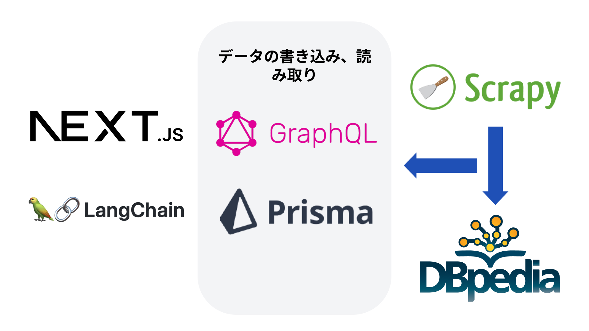

# capitalens

 
    
    

本プロジェクトは、国会での議論、提出された法案、国会議員の情報などを整理し、視覚的に表示することを目的としています。

## 技術構成

現在の技術構成は以下のようになっています。

フロントエンド:

- Next.js
- Tailwind CSS
- LangChain (WIP)
- face-api.js

データの受け渡し

- Prisma
- Apollo GraphQL

バックエンド:

使用している情報について、詳しくは[こちらのページ](https://capitalens.vercel.app/data)をご覧ください。

- Scrapy (参衆サイトや議員ウェブサイトのスクレイピング)
- DBpedia

## お問い合わせ・貢献

フィードバックやご意見は Issue または[Google フォーム](https://docs.google.com/forms/d/e/1FAIpQLSdHZokKXiyXcPgzrZQ0_Jx-LDGc5phcG8gaDHTJwCqMxpK98Q/viewform)までご連絡ください。

## 貢献

[CONTRIBUTING.md](https://github.com/yutakobayashidev/capitalens/blob/main/CONTRIBUTING.md) をお読みください。
